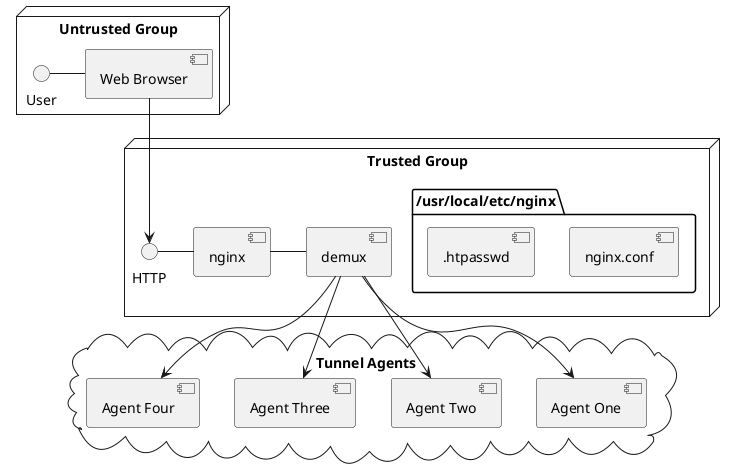

# Readme

## Architecture diagram

This is in plantuml.

```plantuml
@startuml
skinparam componentStyle uml2

node "Untrusted Group" {
  User - [Web Browser]

}
 
node "Trusted Group" {
  [Web Browser] --> HTTP
  HTTP - [nginx]
  [nginx] - [demux]
  folder "/usr/local/etc/nginx" {
    [nginx.conf]
    [.htpasswd]
  }
} 

cloud "Tunnel Agents" {
  [demux] --> [Agent One]
  [demux] --> [Agent Two]
  [demux] --> [Agent Three]
  [demux] --> [Agent Four]
}

@enduml
```

## Prerequisites and dependencies

For the Demux:

1. 
2. 
3. 

For the Router:

1. 

## Configuration

## References
1. 
2. 
3. 
4. 
