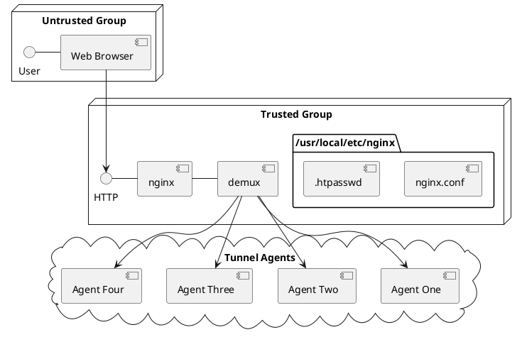
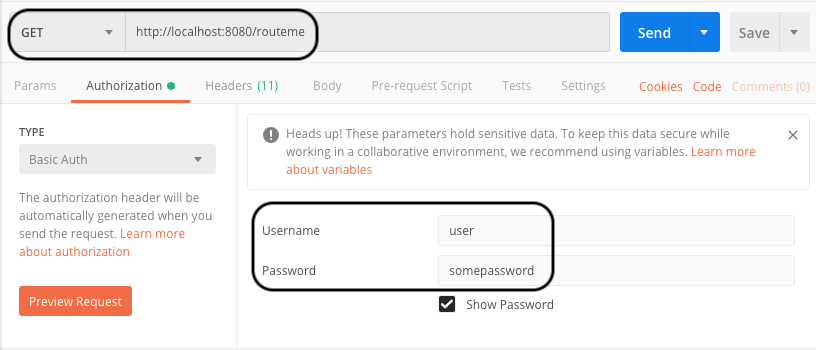
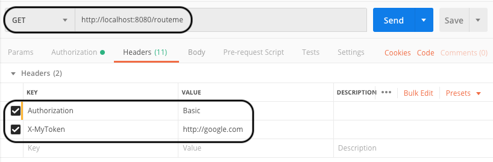

# Readme

## Architecture diagram

This is in .

## Prerequisites and dependencies

For the Demux:

1. 
2. 
3. 

For the Router:

1. 

To test:

1. , or
2. 

## Configuration
1. Ensure all the prerequisites met and dependencies are installed. 
2. Copy the nginx.conf file to the nginx config folder (possibly `/usr/local/etc/nginx`)
3. The .htpasswd file has been generated using this command `htpasswd -cb ./.htpasswd user somepassword`. You must use this (or an equivalend command that works on your OS) to generate this file in your nginx config folder. Do **not** copy the existing file there: the  is either a modified version of MD5-encryption, or the system's `crypt()` routine. It is likely that the routine used by me to generate _this_ .htpasswd file is different from the routine on _your_ computer.
4. .
5. Start the ruby-based demux in the  `ruby demux.rb` 
6. Run a curl command _similar to_ the one in `curl_command`. You'll have to change the Authorization header.
7. Alternatively, use Postman to submit the request. See the two screenshots below on how to configure your request.

8. You should be redirected to the site identified in X-MyToken, **iff** the Authentication passes.

## References
1. 
2. 
3. 
4. 

